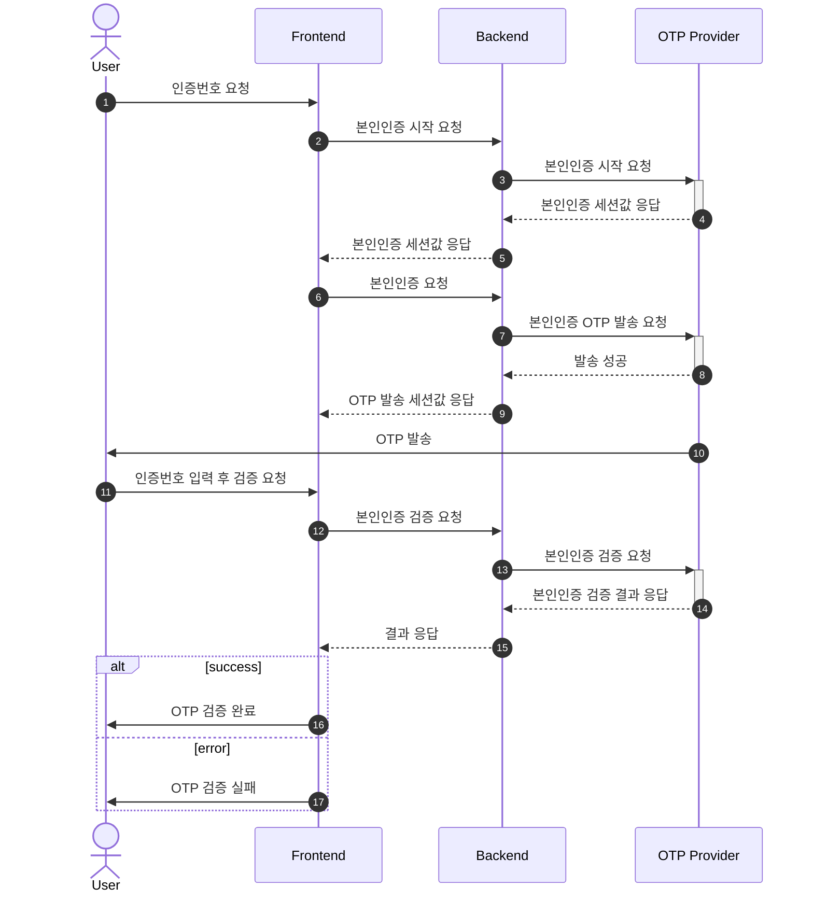

# OTP 인증 순서

```mermaid
sequenceDiagram
    autonumber
    actor User
    participant Frontend
    participant Backend
    participant OTP Provider

    User ->> Frontend: 인증번호 요청

    Frontend ->> Backend: 본인인증 시작 요청
    Backend ->>+ OTP Provider: 본인인증 시작 요청
    OTP Provider -->>- Backend: 본인인증 세션값 응답
    Backend -->> Frontend: 본인인증 세션값 응답

    Frontend ->> Backend: 본인인증 요청
    Backend ->>+ OTP Provider: 본인인증 OTP 발송 요청
    OTP Provider -->>- Backend: 발송 성공
    Backend -->> Frontend: OTP 발송 세션값 응답

    OTP Provider ->> User: OTP 발송

    User ->> Frontend: 인증번호 입력 후 검증 요청
    Frontend ->> Backend: 본인인증 검증 요청
    Backend ->>+ OTP Provider: 본인인증 검증 요청
    OTP Provider -->>- Backend: 본인인증 검증 결과 응답
    Backend -->> Frontend: 결과 응답

    alt success
        Frontend ->> User: OTP 검증 완료
    else error
        Frontend ->> User: OTP 검증 실패
    end
```
