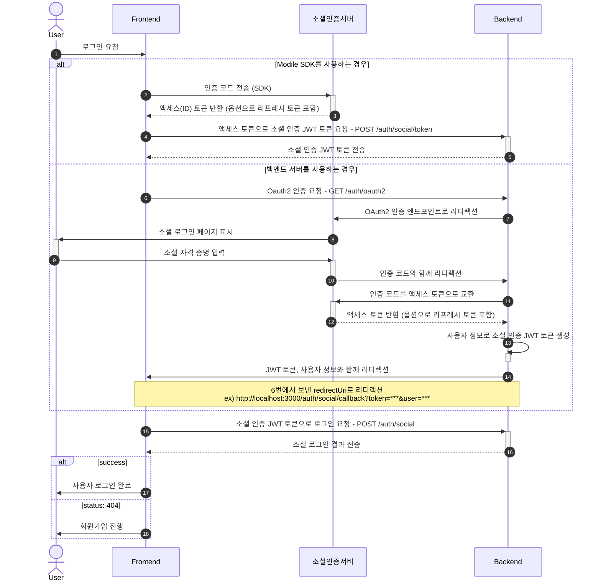

# 소셜 로그인

```mermaid
sequenceDiagram
    autonumber
    actor User
    participant Frontend
    participant 소셜인증서버
    participant Backend
    User ->> Frontend: 로그인 요청

    alt Modile SDK를 사용하는 경우
        Frontend ->>+ 소셜인증서버: 인증 코드 전송 (SDK)
        소셜인증서버 -->>- Frontend: 액세스(ID) 토큰 반환 (옵션으로 리프레시 토큰 포함)
        Frontend ->>+ Backend: 액세스 토큰으로 소셜 인증 JWT 토큰 요청 - POST /auth/social/token
        Backend -->>- Frontend: 소셜 인증 JWT 토큰 전송

    else 백엔드 서버를 사용하는 경우
        Frontend ->> Backend: Oauth2 인증 요청 - GET /auth/oauth2
        Backend ->> 소셜인증서버: OAuth2 인증 엔드포인트로 리디렉션
        소셜인증서버 ->>+ User: 소셜 로그인 페이지 표시
        User ->>- 소셜인증서버: 소셜 자격 증명 입력
        activate 소셜인증서버
        소셜인증서버 ->>- Backend: 인증 코드와 함께 리디렉션
        Backend ->>+ 소셜인증서버: 인증 코드를 액세스 토큰으로 교환
        소셜인증서버 -->>- Backend: 액세스 토큰 반환 (옵션으로 리프레시 토큰 포함)
        Backend ->>+ Backend: 사용자 정보로 소셜 인증 JWT 토큰 생성
        deactivate Backend
        Backend ->> Frontend: JWT 토큰, 사용자 정보와 함께 리디렉션
        Note over Frontend, Backend: 6번에서 보낸 redirectUri로 리디렉션<br />ex) http://localhost:3000/auth/social/callback?token=***&user=***
    end

    Frontend ->>+ Backend: 소셜 인증 JWT 토큰으로 로그인 요청 - POST /auth/social
    Backend -->>- Frontend: 소셜 로그인 결과 전송

    alt success
        Frontend ->> User: 사용자 로그인 완료
    else status: 404
        Frontend ->> User: 회원가입 진행
    end
```
