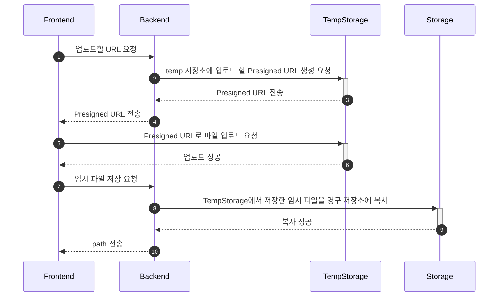

# 파일 업로드 순서



# 저장소 업로드

1. URL

   - [업로드할 URL 조회] 에서 받은 url 사용

2. Content-Type

   - multipart/form-data

3. 파일 용량 제한

   - 이미지: 2mb
   - 기타 (PDF, excel..): 10mb

4. [업로드할 URL 조회] 에서 받은 fields 를 FormData에 추가

   - fields는 동적으로 바뀌므로 mapper 없이 처리해야함

5. 임시저장소에 저장된 파일은 1일 후 파기됨

6. Presigned URL 의 유효 시간은 1시간

7. 파일 다운로드 시에 원본 파일 이름으로 저장 하려면 [임시 파일 저장] 호출 시에 name 추가

### 코드 예시 (javascript)

```javascript
const formData = new FormData()
for (const key in data.fields) {
  formData.append(key, data.fields[key])
}
formData.append('file', file) // 업로드할 파일
```
